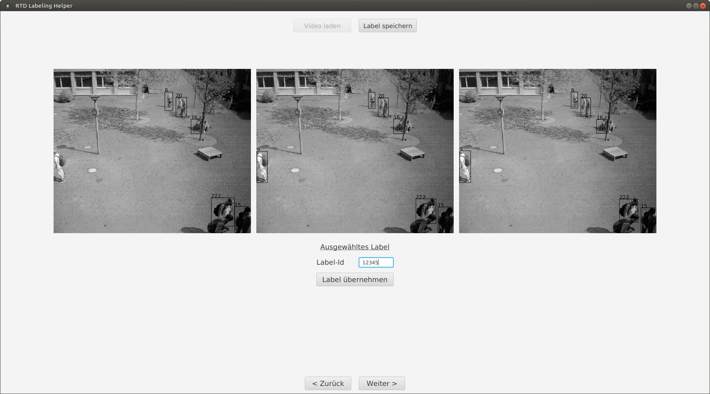

# RTDLH: An offline labeling helper for real time images

---

## Abstract

This software was intentionally created as an alternative of the [Labelbox-Toolkit](https://labelbox.com/) for labeling images and solutions based on an algorithm for people detection and tracking.
As [Labelbox](https://labelbox.com/) and existing alternatives turned out to be not very effective in this field of real time image labeling this shall provide a good (not yet very usable) alternative.

### Usability

Right now the software is very limited in its usabilty due to me being the only one working on it. Therefore the software cannot be downloaded on its own as a runnable application yet because I have no way to host it. The other main reason is, that the only formats supported by now is a specific JSON for the labels and AVI for videos. But I am working on getting other formats to work like single Frames and [Darkflow](https://github.com/thtrieu/darkflow)-CSVs.

---

## Getting started

To get the software up and running you have to compile it. I have not managed to host fully running versions yet. Also by now I only know that it works on Linux (Ubuntu 18.04) and macOS (10.13).

### Prerequisites

You need to have the following software installed:
1. [Oracle Java SE 12 SDK](https://www.oracle.com/technetwork/java/javase/downloads/jdk12-downloads-5295953.html) because it is the only one I used and tested (on Linux follow [this](https://www.oracle.com/technetwork/java/javase/downloads/jdk12-downloads-5295953.html) tutorial!)
2. Everything needed to build OpenCV 3.4.2 (on Linux take a look at [this](https://docs.opencv.org/3.3.0/d7/d9f/tutorial_linux_install.html) tutorial)
3. [OpenCV 3.4.2](https://github.com/opencv/opencv/archive/3.4.2.zip) build on your device and in your users folder (like this: *$HOME/opencv-3.4.2/build/...*)

### Installing

I am using [JetBrains IntelliJ IDE](https://www.jetbrains.com/idea/) for building the software using Gradle! When the project is loaded into IntelliJ it shoud initialize Gradle and the used software by itself! After that, use the **Gradle->tasks->application->run** task to run it and the **Gradle->tasks->distribution->distZIP** task to create a ZIP-file with a runnable script inside!

---

## Technology

The software uses Java (maybe with features from Java12 I do not know actually) and JavaFX (which is not build into Java anymore) for the GUI. For utilizing JSON the [Google's JSON-Simple](https://mvnrepository.com/artifact/com.googlecode.json-simple/json-simple) library is used and for editing images an [OpenCV 3.4.2](https://mvnrepository.com/artifact/org.openpnp/opencv) fork must be used due to circumstances with installed versions of OpenCV and building executables.

---

### Disclaimer

My knowledge is fairly limited so there might be a more elegant solution for building the software, so every help is more than welcomed!
On the other hand my english is not the best, so please forgive me for making mistakes :octocat:
